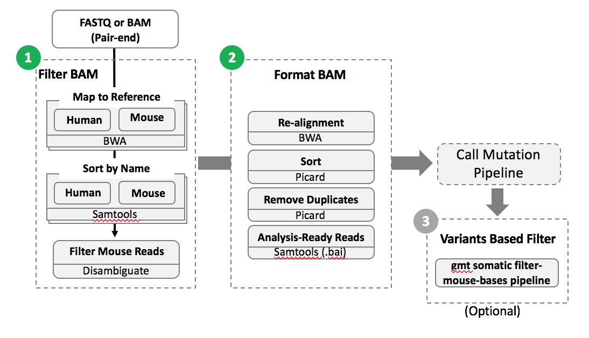

PDXToolkit
===========
PDXToolkit is a mouse reads filtering pipeline from WGS/WES and RNA-seq.

## Workflow



Install
-------
   * Java (JRE1.8.x)
   * conda install -c bioconda bwa=0.7.15
   * conda install -c bioconda samtools=1.5
   * conda install -c bioconda picard=2.17.11
   * conda install -c bioconda bamtools=2.4.0
   * conda install -c bioconda ngs-disambiguate=2016.11.10
   * conda install -c bioconda star=2.5.4a


Usage
-----

        Version 1.0
        Usage:  pdx_disam_kit.sh -p <command> [options]

Key commands:

        dnaFull            Do full step from *.fq.gz to create new bam 
        rnaFull            Do full step from *.fq.gz to create new *.fq.gz
        
        humanBam           Separate step - Only create human bam
        mouseBam           Separate step - Only create mouse bam
        disambiguate       Separate step - Do disambiguate

Options:
        
        -p  <command>      Key command
        -n  <name>         Any name for building folder
        -1  <fastq.gz>     Fastq gzip file
        -2  <fastq.gz>     Fastq gzip file
        -o  <directory>    Output directory
        -d  <directory>    Directory. It use to separate step.


Example
-------


1. WGS/WES full step
        sh pdx_disam_kit.sh -p dnaFull -n sample -1 fq1.gz -2 fq2.gz -o outdir

2. RNA full step
        sh pdx_disam_kit.sh -p rnaFull -n sample -1 fq1.gz -2 fq2.gz -o outdir


3. Separate steps
   * Make human to bam
     sh pdx_disam_kit.sh -p humanBam -n sample -1 fq1.gz -2 fq2.gz -o outdir

   * Make mouse to bam
     sh pdx_disam_kit.sh -p mouseBam -n sample -1 fq1.gz -2 fq2.gz -o outdir

   * Disambiguate
     sh pdx_disam_kit.sh -p disambiguate -n sample -d pdx_wxs_dir


Output
-------
The list of microsatellites is output in "scan" step. The MSI scoring step produces 4 files:

        output.prefix
        output.prefix_dis_tab
        output.prefix_germline
        output.prefix_somatic

for tumor only input, the MSI scoreing step produces 3 files: 

        output.tumor.prefix
        output.tumor.prefix_dis_tab
        output.tumor.prefix_somatic


## Other versions

### Docker version

* Docker files (https://github.com/ding-lab/dockers)
* Usage
     
     ```
      * Only Disambiguate
   
          docker pull hsun9/disambiguate
          docker run hsun9/disambiguate ngs_disambiguate --help


      * Full pipeline of mouse filter (wxs/wgs data) docker image

          docker pull hsun9/disambiguateplus
          docker run hsun9/disambiguateplus ngs_disambiguate --help
     ```
     
### CWL version

The CWL version developed by Matthew Wyczalkowski
(https://github.com/ding-lab/MouseTrap2)


### MGI version for VCF/BED file based mouse filtering (gmt somatic filter-mouse-bases):
> It's not including in PDXToolkit

```
NOTE:Please refer to "example.mgi.gmt.sh"
     If test the example.mgi.gmt.sh, you must modify the vars including name, outDir and bed.
     The shell script only run in MGI servers.
     
     The *.permissive.out is the final filtered result.
```

  * __Test sample__

  ```
  name="example"                   #-- any name
  outDir=/example/outFolder        #-- any dir
  bed=/example/target.bed          #-- any bed file
  hg19=/path/GRCh37-lite.fa        #-- GRCh37
  mm10=/path/Mus_musculus.GRCm38.dna_sm.primary_assembly.fa
  chain10=/path/hg19ToMm10.over.chain

  gmt somatic filter-mouse-bases --chain-file=$chain10 \
    --human-reference=$hg19 \
    --mouse-reference=$mm10 --variant-file=$bed \
    --filtered-file=$outDir/log/$name.mouse.hg19toMm10.out \
    --output-file=$outDir/$name.hg19toMm10.permissive.out --permissive

  ## target.bed (create based on VCF)
  1 121009 121009 C T

  ## chain download 
  http://hgdownload.cse.ucsc.edu/goldenpath/hg19/liftOver/hg19ToMm10.over.chain.gz
  ```


Contact
-------
Hua Sun, <hua.sun@wustl.edu>

